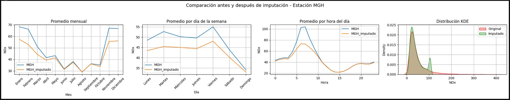
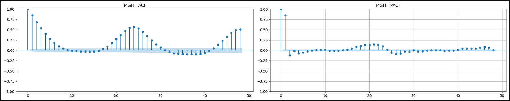
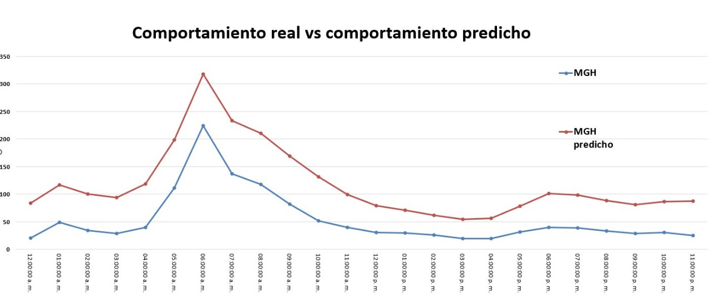
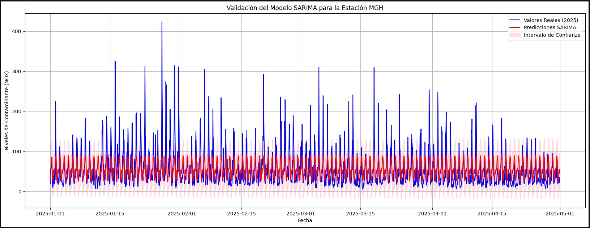

# 🌫️ Análisis y Predicción de la Calidad del Aire en la CDMX (2020–2025) — Modelo SARIMA

Este proyecto tiene como objetivo estudiar el comportamiento de contaminantes suspendidos en el aire de la Ciudad de México, en particular el dióxido de nitrógeno (NOx). A partir de datos históricos proporcionados por la Dirección de Monitoreo Atmosférico, se realizaron visualizaciones detalladas, transformaciones  y el entrenamiento de modelo SARIMA para predecir la concentración horaria de NOx en distintas estaciones de monitoreo. Es aplicable para otros contaminantes.

---

## 🎯 Objetivos del análisis

- Explorar el comportamiento del NOx en la CDMX.
- Visualizar su variación diaria, semanal y mensual.
- Tratar los datos para el entrenamiento de modelos predictivos.
- Medir la eficacia del modelo SARIMA en escenarios reales.

---

## 🗃️ Datos utilizados

- **Fuente**: [Dirección de Monitoreo Atmosférico](https://www.aire.cdmx.gob.mx/default.php?opc=%27aKBh%27)
- **Formato**: Archivos `.zip` por año, con archivos `.xls` por contaminante.
- **Ejemplo**: `20RAMA.zip > 2020NOX.xls`

---

## 🛠️ Librerías utilizadas

```python
- pandas
- numpy
- seaborn
- matplotlib
- statsmodels
- sklearn
```

---

## 📁 Estructura del proyecto

```
├── datos_ambientales/     # Datos originales
├── reports/               # Gráficas generadas
│   ├── comportamiento.jpg
│   ├── correlograma.jpg
│   ├── prediccion_1_enero_25.jpg
│   ├── SARIMA.jpg
├── notebooks/             # Desarrollo en Jupyter Notebook
│   └── Analisis_calidad_aire_CDMX.ipynb
├── README.md
├── requirements.txt
```
---

## 📊 Visualización de datos

A lo largo del proyecto se generaron visualizaciones clave para entender el comportamiento del NOx y validar el modelo SARIMA:

### 🔹 Comportamiento del NOx tras imputación y winsorización


### 🔹 Correlograma con lag 48 (frecuencia horaria)


### 🔹 Predicción SARIMA para el 1 de enero de 2025


### 🔹 Predicción extendida hasta el 1 de mayo de 2025


---

## 📈 Resultados del modelo SARIMA

Se entrenó un modelo SARIMA por estación de monitoreo. Para la estación **MGH**, se obtuvo:

- **Parámetros**: `order=(1, 0, 1)`, `seasonal_order=(0, 1, 1, 24)`
- **MAE**: 24.04
- **RMSE**: 35.43

El modelo logró capturar el patrón estacional y la forma de la serie, aunque subestimó los valores reales. Se identificó una estacionalidad diaria clara y se aplicó diferenciación estacional (`D=1`) para estabilizar la serie.

---
## 📓 Notebook del proyecto

Puedes explorar el desarrollo completo del análisis y modelado en el siguiente notebook:

👉 [Ver notebook](notebooks/analisis_nox_sarima.ipynb)

---
## 📌 Notas

Este proyecto fue desarrollado en Jupyter Notebook como parte de un portafolio personal. Cada paso incluye:

- Descripción del proceso.
- Interpretación de resultados.
- Justificación del siguiente paso.

Está pensado para ser fácil de seguir y replicar, incluso sin conocimientos técnicos profundos.

---

## 👨‍💻 Autor

**Alejandro Fuentes**  
Ingeniero en Sistemas y estudiante de ultimo de Ciencia de Datos para Negocios  
---

## 📜 Licencia

Este proyecto está bajo la licencia MIT. Consulta el archivo `LICENSE` para más detalles.
 ---
